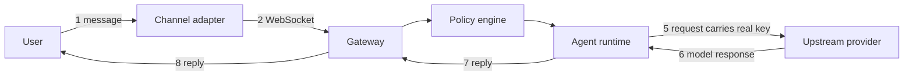

# Session 12 — Assignment Notes (glc_v2)

Working documentation for the Session 12 security assignment: migrate `glc_v2` to
Modal, harden it against the known findings (Part 1), then hunt for new
invariant-breaking bugs (Part 2). This file collects the assignment brief, the
execution plan, the threat model / findings table, and a map of the codebase.

- [1. The assignment](#1-the-assignment)
- [2. The eight security invariants](#2-the-eight-security-invariants)
- [3. Execution plan](#3-execution-plan)
- [4. Threat model and findings](#4-threat-model-and-findings)
- [5. Codebase map](#5-codebase-map)

---

## 1. The assignment

Two parts. Part 1 is the required floor and is not scored beyond pass/fail. Part
2 is where points are won.

### Part 1 — Migrate and harden (required)

1. Migrate `glc_v2` to your **own** Modal account exactly as Session 12 Section 6
   walks it, using mock keys, and confirm the gateway is live.
2. Reproduce every finding in Section 6 (console findings A/B/C) and Section 7
   (the ten code leaks) against your own deployment. Do not fix yet.
3. Fix every one of those findings in your clone.
4. Submit a link to your hardened clone plus a short note that, for each finding,
   names the invariant it broke and shows the fix. **No PRs required for Part 1.**

Real provider keys are never needed — the point is proving that *any* key (even a
fake one) can be stolen, so mock keys are fine everywhere.

### Part 2 — Find something new (100 points each)

- Find bugs that Sections 6 and 7 do **not** already name. Re-reporting known
  issues earns nothing.
- Every bug **must** map to breaking one of the eight invariants below.
- Each finding is submitted as a **pull request against the `glc_v2` repo**
  containing: (a) a short description, (b) a repro script/steps from a fresh
  checkout, and (c) the fix that closes it.
- A PR that does not reproduce, or reports without fixing, scores zero.
- On duplicates, the first PR filed wins — check open PRs before filing.

### Rules and logistics

- Work only against your own deployment and the `glc_v2` repo. Never attack other
  students, the school, or real upstream providers. Keep every deployment on mock
  keys.
- Deadline: one week from Saturday; 48-hour late window at a 30% penalty.

---

## 2. The eight security invariants

These are the scoring spine for both parts. Every finding names the one it breaks.

1. Adapters must never see provider API keys.
2. Every action must be checked against the actual user, tenant, and final
   arguments.
3. External content must always be treated as data, never as instructions.
4. A credential must work only for one specific tool call.
5. Each tenant must have separate memory, and every stored fact must record its
   source (provenance).
6. Dangerous or high-impact actions must be approved with their final parameters.
7. Components must not be able to edit or delete their own audit logs.
8. Every run must have hard limits on time, tokens, tool calls, and cost.

### Attacker roles (weakest to strongest)

1. Outsider on the public internet, no credentials.
2. Normal channel user, controls only the text they type.
3. Attacker who has taken over a single adapter container.
4. Attacker with code execution inside the gateway process itself.

The best findings *climb* this ladder — e.g. a chat user reaching code execution
in the gateway.

---

## 3. Execution plan

### Step 1 — Migrate to Modal (operator setup only you can do)

```sh
uv add modal
uv run modal setup    # browser auth, writes API token

uv run modal secret create glc-llm-keys \
  GEMINI_API_KEY=mock-not-real GITHUB_ACCESS_TOKEN=mock-not-real \
  GROQ_API_KEY=mock-not-real NVIDIA_API_KEY=mock-not-real \
  CEREBRAS_API_KEY=mock-not-real OPEN_ROUTER_API_KEY=mock-not-real

uv run modal deploy modal_app.py
```

The wrapper `modal_app.py` already exists in the repo. Verify:

```sh
curl <url>/healthz          # expect {"ok": true, ...}
# open <url>/docs in a browser
```

### Step 2 — Reproduce (no fixes yet)

Run each Section 6 finding and each Section 7 leak against the live deployment or
the two-file in-process harness. For each, write one line: which invariant it
breaks + which attacker role reaches it. This becomes the Part 1 submission note.

### Step 3 — Fix (Part 1). The fixes cluster into these moves:

- **Auth in front of the data plane** (A1/A2, C5): add an auth dependency to
  `/v1/chat`, `/chat/batch`, `/embed`, `/vision`, `/speak`, `/transcribe`; gate
  `/v1/status|providers|capabilities|cost/by_agent|calls`; disable `/docs` and
  `/openapi.json` in prod.
- **SSRF fix** (C1): in `_resolve_image_urls`, add an allowlist, block
  loopback/private/link-local for IPv4 + IPv6, and re-check the host after every
  redirect (stop blind `follow_redirects=True`).
- **Channel envelope check** (C2 / leak 9): in `channel_ws`, reject when
  `env.channel != name`, close the socket, and audit the attempt.
- **WS token hygiene** (C3): accept the token via header only, short-lived; stop
  reading `?token=` from the query string.
- **Verbose errors + limits** (C4, C5): generic error to the client, detail to
  server logs; per-endpoint rate limits + hard budget caps.
- **Audit / cost / pairing integrity** (leaks 2, 3, 10; invariant 7): make the
  audit log append-only + hash-chained; validate token counts in `db.log_call`;
  keep `force_pair_owner` off any in-process reach.
- **Reproducible image** (A5): build from `uv.lock`, pin the base image by digest
  instead of `>=` ranges.
- **SQLite writer** (A6): single append-only writer (or `min_containers=1`) to
  avoid concurrent-writer corruption; commit/reload the Volume.

Architectural leaks (leak 1 in-process secrets, leak 5 policy monkey-patch, leak 7
subprocess, leak 8 `os.kill`) only fully close with per-adapter
containers/Sandboxes and scoped per-call credentials. Document the partial
mitigation you apply for these.

After each fix: commit naming the invariant it broke, then re-run the Step 2 repro
and confirm the attack now fails.

### Step 4 — Part 1 deliverable

Hardened clone + a short note per finding (invariant + fix). Link to the clone.

### Step 5 — Part 2 hunt

- Recon: read `docs/ARCHITECTURE.md`, enumerate endpoints from `/openapi.json`,
  grep `os.environ` / `Secret.from_name`, read each adapter under
  `glc/channels/catalogue/`.
- Walk STRIDE per component (gateway, each adapter, whisper_cpp, vision, control
  plane) and cross-check the OWASP LLM / Agentic lists.
- Rank hypotheses by impact, chase the top few, and verify novelty against
  Sections 6/7 before filing.
- Each new invariant-breaking bug = one PR to `glc_v2` (description + fresh-checkout
  repro + fix).

### One-week cadence

- Day 1: migrate + reproduce.
- Days 2-3: fix Part 1.
- Days 4-6: hunt + open PRs.
- Day 7: polish, dedup-check open PRs.

---

## 4. Threat model and findings

### Trust boundaries



The two boundaries the session keeps returning to: **arrow 2** (adapter into the
gateway) and **arrow 5** (gateway out to a provider). An asset is exposed wherever
a flow crosses from a more-trusted principal to a less-trusted one with no check.

### Section 6 findings (deployment-layer, from the migration)

Grouped as A (introduced/elevated by the migration), B (inherited in-process
leaks), C (inherited endpoint/logic issues, now internet-reachable).

- **A1** Public data plane, no auth — `/v1/chat`, `/chat/batch`, `/embed`,
  `/vision`, `/speak`, `/transcribe` run for anyone with the URL. Invariant 8 /
  role 1. Fix: auth in front of the data plane.
- **A2** Unauthenticated info disclosure — `/v1/status|providers|capabilities|
  cost/by_agent|calls`, plus `/docs` and `/openapi.json`. Fix: gate them, disable
  Swagger in prod.
- **A3** Single Function = no egress wall (leak 6, proven). Fix: run untrusted
  parts as Sandboxes with an outbound domain allowlist.
- **A4** One Secret for the whole Function (leak 1). Every in-process line reads
  all keys via `os.environ`. Invariant 1. Fix: separate adapters + scoped creds.
- **A5** Non-reproducible image — rolling `debian_slim` + `>=` ranges. Fix: build
  from lockfile, pin base by digest.
- **A6** Audit DB on a Volume with `min_containers=0` + autoscale = concurrent
  SQLite writers = corrupted audit trail. Invariant 7. Fix: single writer / real DB.
- **B1-B8** In-process leaks the migration did not close (env holds all keys, audit
  DELETE/DROP, `force_pair_owner`, install token readable, policy monkey-patch,
  `os.kill(getpid)`, cost-ledger poisoning, shell/subprocess present).
- **C1** SSRF via `/v1/vision` (public + unauth). Invariant 2/3. Fix: allowlist +
  block private/link-local (v4+v6) + re-check after redirects.
- **C2** Cross-channel envelope spoofing (leak 9). Fix: reject mismatches at socket.
- **C3** WS token in query string. Fix: header-only, short-lived tokens.
- **C4** Verbose upstream errors. Fix: generic error to client, detail to logs.
- **C5** No rate limits or budget on public data plane. Invariant 8. Fix: limits.
- **C6** Pairing-code brute force (candidate) — 6-digit codes, no visible rate limit.

### Section 7 — the ten code leaks (open after Move 1)

| # | Leak | Invariant | Fix direction |
|---|------|-----------|---------------|
| 1 | Shared process environment; any code reads every key | 1 | Per-adapter container + Secret + scoped per-call credential |
| 2 | Audit DB writable at OS layer (`DELETE FROM audit_log`) | 7 | Mount audit only in gateway; append-only + hash-chained |
| 3 | Pairing DB writable + `force_pair_owner()` reachable in-process | 2 | Component separation |
| 4 | Install token readable in-process | 2/4 | Bind token to gateway alone once separated |
| 5 | Policy engine monkey-patchable (`engine.evaluate = lambda ...`) | 2/6 | Run policy engine in a separate process |
| 6 | Unbounded network egress | 1/3 | Adapters as Sandboxes with egress allowlist |
| 7 | Unrestricted subprocess/shell (whisper_cpp) | 3 | Minimal images, non-root, read-only FS, seccomp, egress limits |
| 8 | Adapter kills gateway (`os.kill(getpid, SIGTERM)`) | 8 | Separate PID namespace |
| 9 | Cross-channel envelope spoofing on WS route | 2 | App-layer check `env.channel == route name` |
| 10 | Cost-ledger poisoning via `db.log_call` (no validation) | 8 | Process separation + signed writer |

Move 1 closed **none** of the ten. Leaks 1-5, 7, 8, 10 close via component/process
separation; leak 6 via Sandboxes + egress allowlist; leak 9 via one app-layer check.

### Part 2 hunting candidates (verify novelty before filing)

- Timing-unsafe install-token comparison — `_require_token` uses `!=` rather than
  `hmac.compare_digest` (`glc/routes/control.py:28`). Invariant 2.
- Pairing-code brute force — 6-digit codes, confirm whether any pairing path is
  reachable and unthrottled. Invariant 2/4.
- Per-channel webhook verify-token weaknesses (`{NAME}_VERIFY_TOKEN`).
- Trust-level / envelope spoofing chains beyond leak 9.
- Cost-amplification / recursive-call loops. Invariant 8.

---

## 5. Codebase map

FastAPI app `glc.main:app`. `uv` project, package `glc-v1`. Runs locally with
`uv run glc serve` on port 8111; deploys via `modal_app.py`.

### Layout

```
glc/
├── main.py, cli.py, config.py, db.py, providers.py, embedders.py,
│   routing.py, pricing.py, cache.py, llm_schemas.py, channels.yaml
├── audit/          # append-only audit.sqlite store
├── policy/         # engine.py, policy.yaml, schemas.py
├── security/       # pairing.py, allowlists.py, rate_limits.py, trust_level.py
├── routes/         # chat.py, channels.py, control.py, transcribe.py, speak.py
├── channels/       # base.py, envelope.py, registry.py, catalogue/<name>/adapter.py
└── voice/          # stt/ and tts/ routers + provider catalogues
```

No `Dockerfile`/`Containerfile` exists yet. `modal_app.py` is present.

### Routes

HTTP: `GET /`, `GET /healthz`, `POST /v1/chat`, `POST /v1/chat/batch`,
`POST /v1/vision`, `POST /v1/embed`, `GET /v1/embedders`, `GET /v1/cost/by_agent`,
`GET /v1/providers`, `GET /v1/capabilities`, `GET /v1/status`, `GET /v1/routers`,
`GET /v1/calls`, `POST /v1/transcribe`, `POST /v1/speak`, `POST /v1/control/pair`,
`POST /v1/control/pair/confirm`, `GET /v1/control/presence`, `POST /v1/control/kill`,
`GET|POST /v1/channels/{name}/webhook`. FastAPI also serves `/docs` + `/openapi.json`.

WebSocket: `WS /v1/channels/{name}` (`glc/routes/channels.py`).

### Provider keys (`glc/providers.py` `build_providers()`)

Read from env: `GEMINI_API_KEY`, `NVIDIA_API_KEY`, `GROQ_API_KEY`,
`CEREBRAS_API_KEY`, `OPEN_ROUTER_API_KEY`, `GITHUB_ACCESS_TOKEN`, plus local
`OLLAMA_MODEL`. No `OPENAI_API_KEY`. Loaded once at startup via `load_dotenv` +
`os.getenv`, so every in-process line can read them (leak 1 / A4).

### Config and databases

`GLC_CONFIG_DIR` (default `~/.glc/`, Modal `/data/glc`) holds `install_token`,
`policy.yaml`, `channels.yaml`. SQLite DBs (env-overridable):

- Audit log — `GLC_AUDIT_DB` → `~/.glc/audit.sqlite` (`glc/audit/store.py`)
- Pairing — `GLC_PAIRING_DB` → `~/.glc/pairings.sqlite` (`glc/security/pairing.py`)
- Cost/call ledger — `GLC_GATEWAY_DB` → `~/.glc/gateway.sqlite` (`glc/db.py`)

### Security-relevant code

- `force_pair_owner(...)` — `glc/security/pairing.py:187`. Grants `owner_paired`;
  documented as not HTTP-exposed but reachable in-process (leak 3).
- Policy `evaluate(...)` — `glc/policy/engine.py:100`. Module-level wrapper at
  `:168`. Note: **not wired into any route handler yet**; only exercised in tests.
- `db.log_call(...)` — `glc/db.py:75`. Writes cost ledger with caller-supplied
  token counts, validates nothing (leak 10).
- Audit `append(...)` — `glc/audit/store.py:67`. Append-only at the app layer; the
  SQLite file itself has no enforcement beyond FS permissions (leak 2).
- `_resolve_image_urls` / `_fetch_to_data_url` — `glc/routes/chat.py:288`. Fetches
  arbitrary http(s) URLs with `follow_redirects=True`, no private-IP blocklist (C1
  SSRF). `/v1/vision` (`:657`) delegates here.
- `channel_ws` — `glc/routes/channels.py:35`. Auth via install token; **does not
  check `env.channel == name`** (leak 9). Token accepted via `?token=` query (C3).
- `whisper_cpp` subprocess — `glc/voice/stt/providers/whisper_cpp/wrapper.py:54`.
  `subprocess.run([...], check=True)` (leak 7).
- `/v1/control/kill` — `glc/routes/control.py:99`. Requires install token + loopback
  client unless `GLC_KILL_ALLOW_REMOTE=1`. `_require_token` (`:23`) uses a plain
  `!=` string compare (timing-unsafe, Part 2 candidate).

### Channel adapters

15 under `glc/channels/catalogue/`: discord, gmail, imap, line, local_mic, matrix,
signal, slack, teams, telegram, twilio_sms, twilio_voice, webhook, webui, whatsapp.
Auto-discovered by `glc/channels/registry.py`; each exposes an `Adapter` class.

### Security posture summary

| Area | Status |
|------|--------|
| Install token | Required for WS + control plane |
| Policy engine | Implemented but not hooked into routes |
| Channel WS | Echo stub; no `env.channel` vs route-name check |
| Vision fetch | Unrestricted SSRF surface on http(s) image URLs |
| Kill endpoint | Token + loopback (bypass via env) |
| Audit | Append-only at app layer only; file writable in-process |
| Container isolation | Not built (per `docs/ARCHITECTURE.md`) |
